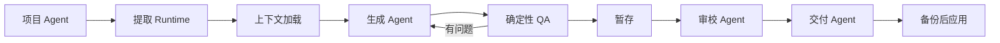

# Localize Anything · 本地化基础架构

<p align="center">
  <strong>面向真实项目的智能体原生本地化基础设施。</strong><br>
  <em>大模型可以生成译文。Localize Anything 让本地化可交付。</em>
</p>

<p align="center">
  <a href="README.md">English</a> ·
  <a href="#localize-anything--本地化基础架构">简体中文</a>
</p>

<p align="center">
  
  
  
  
  
</p>

---

## 为什么需要这个项目？

大模型可以生成译文，但真正的项目本地化还需要：

- **结构保护** — placeholder、标记、格式不能破坏
- **上下文记忆** — 已审核的翻译不应被无意义覆盖
- **术语控制** — 风格和术语一致性需要证据链
- **审校证据** — 谁审核了什么、何时审核
- **分阶段交付** — 生成→暂存→QA→审核→应用，不是一键覆盖
- **可回滚应用** — 覆盖前备份，冲突时阻断

Localize Anything 解决的是这中间**缺失的工程层**。

## 它能做什么

- **提取** 真实项目中的可翻译内容（Android strings.xml、iOS .strings、JSON、PO 等）
- **规划** 根据运行模式判断哪些需要生成、哪些需要保留
- **生成** 通过 LLM agent 生成译文，携带上下文和术语参考
- **暂存** 所有输出写入隔离的 staging 目录 — 绝不直接触碰你的源码
- **QA** 确定性检查 placeholder、标记完整性、格式合规
- **审校** 人工审核 + 分段签字确认
- **应用** 仅在你明确确认 run ID 后执行，覆盖前自动备份

## 工作流程



## 安全模型

Localize Anything 默认安全。

| 安全特性 | 如何保障 |
|---------|---------|
| **暂存优先** | 所有输出进入独立的 staging 目录，不接触源码 |
| **试运行计划** | 文件操作在执行前预览 |
| **显式确认** | 应用需要 `--confirm-run-id` 与交付清单匹配 |
| **自动备份** | 每个被覆盖的文件在执行前备份 |
| **源码不变性检查** | 每次运行前后做 SHA-256 哈希对比 |
| **禁止静默覆盖** | 冲突文件阻断应用直到解决 |
| **凭证隔离** | API key/token 不写入 memory 或交付包 |
| **仅目标键保护** | 源文件中不存在的目标侧 key 被检测并保留，不静默删除 |
| **盲测隔离** | `reference_policy=blind` 防止已有译文泄漏到生成工件中 |

## 运行模式

| 模式 | 用途 | 默认策略 |
|------|------|---------|
| `greenfield_localization` | 全新语言的本地化 | `style_only` — 仅参考风格，不复制译文 |
| `existing_locale_maintenance` | 维护已有翻译 | `preserve_existing` — 保留已审核译文，只生成新增/变更/缺失 |
| `rewrite_or_harmonization` | 重写或风格统一 | `tm_assisted` — 以 TM 辅助生成 |
| `blind_benchmark` | 盲测基准 | `blind` — 完全隔离已有译文，不泄漏到生成工件 |

## 支持的格式

| 领域 | 适配器 | 状态 |
|------|--------|------|
| Android | `core.android-strings` | 稳定 |
| iOS | `core.ios-strings` | 实验性 |
| iOS String Catalog | `core.xcstrings` | 实验性 |
| JSON locale | `core.json-locale` | 稳定 |
| YAML / TOML | `core.yaml-toml` | 稳定 |
| CSV / TSV / XLSX | `core.tabular` | 稳定 |
| Markdown / HTML | `core.markup` | 稳定 |
| SRT / VTT | `core.subtitles` | 稳定 |
| XLIFF 1.2 / 2.0 | `core.xliff` | 稳定 |
| GNU gettext | `core.gettext-po` | 稳定 |

详见 [Adapter Contract](docs/adapters.md)。

## 实测证据

### v0.2.1 模式系统基准

4 种运行模式全部通过，验证了：

- **盲测隔离**：已有译文不会泄漏到生成工件中
- **维护保留**：已审核且未变更的译文被保留，不会被大量重写
- **仅目标键保护**：源文件中不存在的 target-only key 被检测、暂存、不静默删除
- **源码不变性**：所有模式运行前后 fixture 文件哈希一致

运行命令：`python benchmarks/v021-mode-system/run.py`

### AntennaPod DeepSeek 翻译测试

| 指标 | 日语 (ja) | 韩语 (ko) |
|------|----------|----------|
| 源项目 | AntennaPod `develop` 分支 | 同 |
| 段数 | 869 | 869 |
| 批次 | 29（每批30段） | 29 |
| 模型 | `deepseek-chat` | `deepseek-chat` |
| QA | 0 blocking, 0 warnings | 0 blocking, 0 warnings |

完整流程：extract → batch → DeepSeek API → collect → stage → QA → deliver。
两种语言均在 AntennaPod 中编译通过（`:app:assembleFreeDebug` 成功）。

> **注意**：这是工程与自动化 QA 证据，不是对译文质量的专业评估。

## 快速开始

```bash
# 安装
pip install -e ".[yaml]"

# 验证协议
python -m runtime.localize_anything validate-protocol
python -m runtime.localize_anything validate-contracts

# 运行测试
python -m unittest discover -s tests -v

# 运行基准测试
python benchmarks/v021-mode-system/run.py
```

## 项目不是

Localize Anything **不是**：

- 一个 prompt 合集
- 一个通用机器翻译包装器
- APK / IPA 重打包工具
- 人工审校的替代品
- 会静默覆盖你源码的工具
- 声称 LLM 输出无需证据即可投产的工具

## 许可证

MIT — 详见 [LICENSE](LICENSE)。
